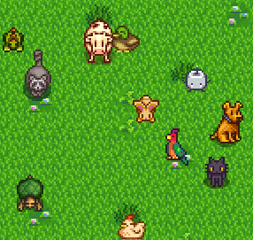
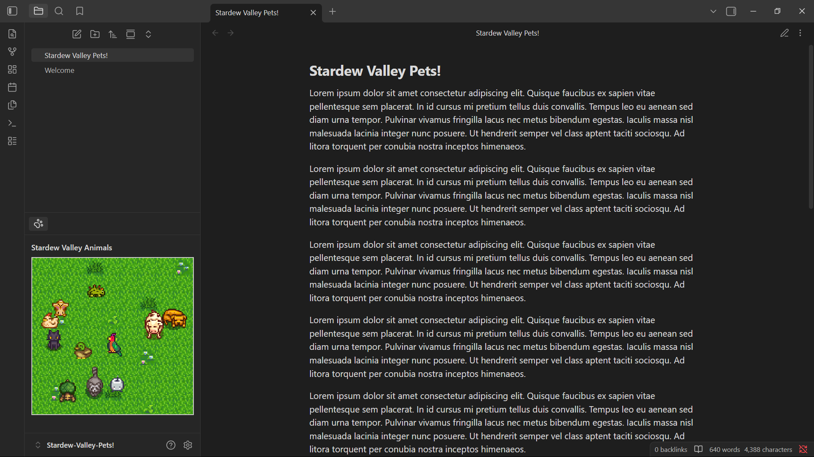

# Stardew Pets



Bring a tiny animated farm to your vault. Stardew Pets adds a playful view where pixel pets wander around, idle, and take naps while you work.

## Open The View

1. Open the Command Palette (CRTL + P).
2. Run `Stardew Pets for Obsidian: Open Stardew Animals`.
3. Enjoy!



## What You Get

- A dedicated Stardew Pets view on your sidebar.
- Natural movement patterns with pauses and occasional sleep.

## Future Updates:

- Background changes.
- Full control over which pets you want in the farm.

## Development

- Clone the git repo in your plugnis folder.
- Install: `npm install`
- Dev build: `npm run dev`


```
<Vault>/.obsidian/plugins/Stardew-Pets-for-Obsidian/
```
